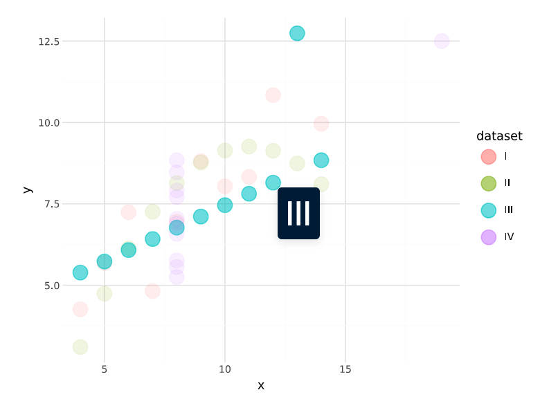
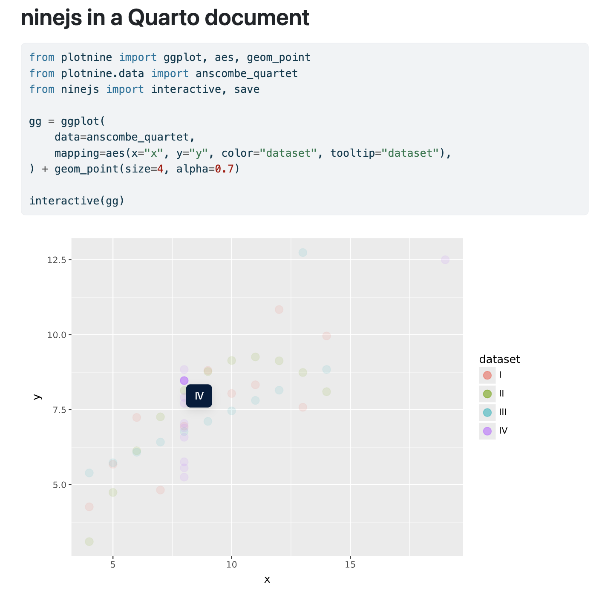
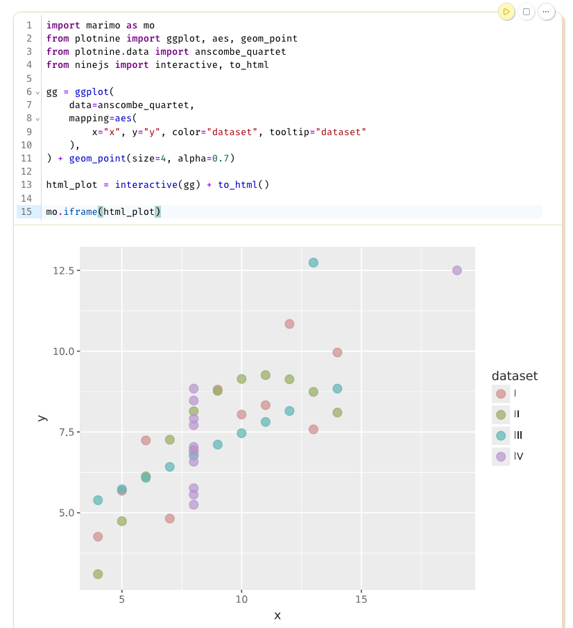
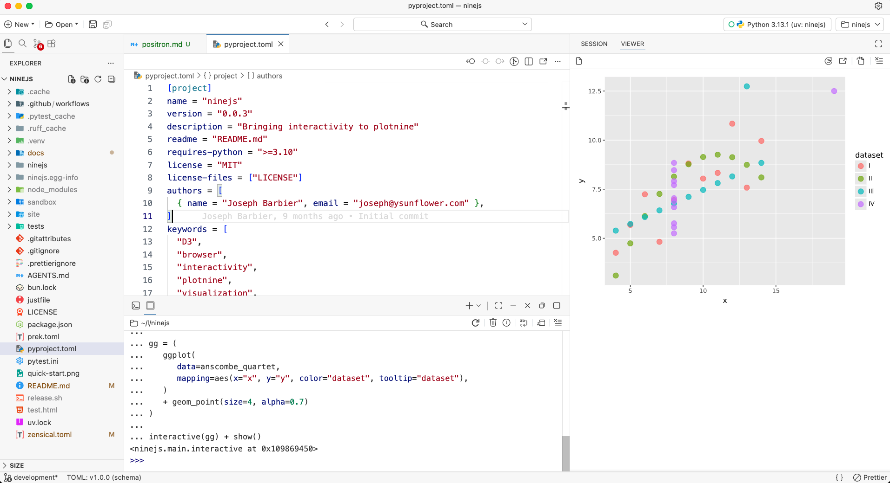

<div align="center" style="font-size: 1.6em">

# ninejs

</div>

<div  align="right">

Bringing ✨***interactivity***✨ to [plotnine](https://plotnine.org/).

</div>

`ninejs` lets you add tooltips and hover grouping to plotnine plots directly from `aes()` via the `tooltip` and `data_id` aesthetic mappings, then export the result as a standalone HTML plot.

It works right out of the box for Quarto, marimo, shiny and has built-in preview for Positron.

<br>

## Quick start

```python
from plotnine import aes, geom_point, ggplot, theme_minimal
from plotnine.data import anscombe_quartet

from ninejs import css, interactive, save

gg = (
  ggplot(
      anscombe_quartet,
      aes(x="x", y="y", color="dataset", tooltip="dataset", data_id="dataset")
  )
  + geom_point(size=7, alpha=0.5)
  + theme_minimal()
)

(
  interactive(gg)
  + css(from_dict={".tooltip": {"font-size": "2em"}})
  + save("plot.html")
)
```



<br>

## Installation

```bash
pip install ninejs
```

<br>

## Integration

`ninejs` works with your other tools right out of the box!

- Quarto



- Marimo



- Shiny


- Positron



- Anywhere! `ninejs` outputs HTML files: they only need a browser. This means that any website or web-based tool can integrate ninejs seamlessly.

The next targets are:

- Jupyter
- Streamlit

<br>

## Documentation

See the full documentation and examples [here](https://y-sunflower.github.io/ninejs/).

See [the contributing guide](docs/contributing.md) for local setup, tests, and formatting.
