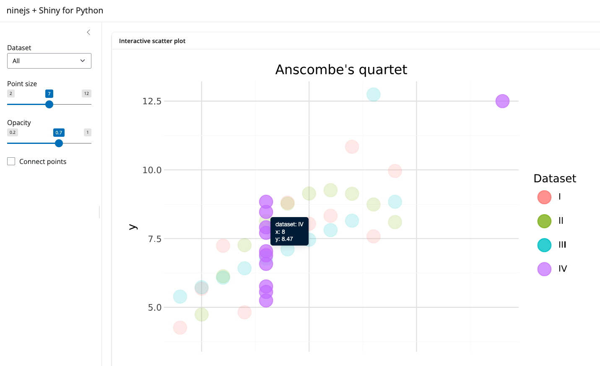

In [shiny](https://shiny.posit.co/py/) for Python, you need to use the `to_iframe()` function and . Inside your `server()` function in `app.py`, you could do something like this:

```python
@reactive.calc
def plot():
   dataset = input.dataset()

   gg = (
      ggplot(
            filtered_data(),
            aes(x="x", y="y", color="dataset", tooltip="tooltip", data_id="dataset"),
      )
      + geom_point(size=input.point_size(), alpha=input.opacity())
      + labs(x="x", y="y", color="Dataset")
      + theme_minimal()
   )

   return gg

@render.ui
def scatter_plot():
   return ui.HTML(
      interactive(plot())
      + to_iframe(
            height="90%",
            width="70%",
            title="Interactive Anscombe scatter plot",
      )
   )
```


