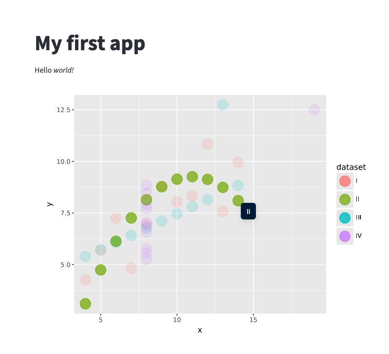

In [Streamlit](https://streamlit.io/), use the built-in `st.iframe()` function. This function expects an HTML string, which you can create with the `to_iframe()` function from `ninejs`.

```python
import streamlit as st
from plotnine import ggplot, aes, geom_point
from plotnine.data import anscombe_quartet

from ninejs import interactive, to_iframe

st.write("""
# My first app
Hello *world!*
""")


gg = ggplot(
    data=anscombe_quartet,
    mapping=aes(x="x", y="y", color="dataset", tooltip="dataset", data_id="dataset"),
) + geom_point(size=8, alpha=0.7)

iframe_plot = interactive(gg) + to_iframe()

st.iframe(iframe_plot)
```


