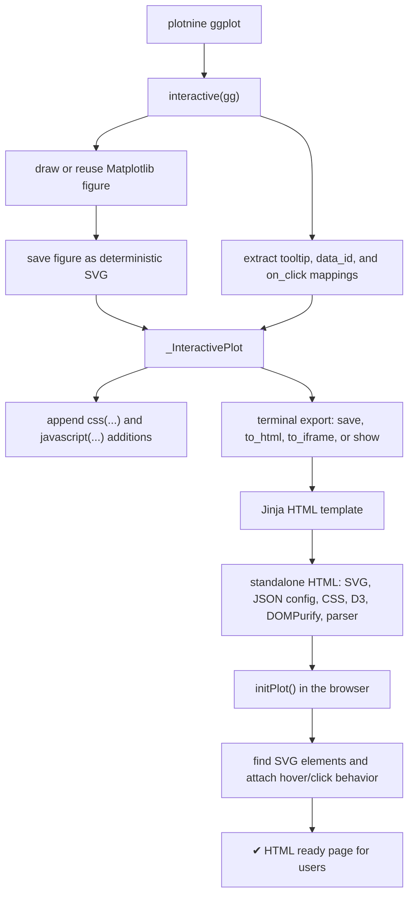

`ninejs` turns a normal plotnine chart into a self-contained HTML document.
The important idea is simple: plotnine still draws the chart, and `ninejs`
adds browser behavior on top of the SVG that plotnine produces.



## The mental model

There is **no** custom plotting engine in `ninejs`. The chart is still a plotnine chart. plotnine builds the data, creates the Matplotlib artists, and Matplotlib writes the SVG. This is very practical because it means we're 100% sure that the displayed chart is exactly as expected. `ninejs` then does two extra things:

1. It extracts the interactivity metadata from the plotnine object.
2. It ships JavaScript that reconnects that metadata to the matching SVG
   elements in the browser.

That second step is the delicate part. The browser parser depends on the SVG
structure emitted by Matplotlib, so changes to SVG parsing should be small,
tested, and checked in a browser.

!!! important

      This is possible because an SVG element inside an HTML page is part of the DOM, which means we can attach any browser side behavior to it.

## Python side

The public entry point is `interactive(gg)` in `ninejs/main.py`.

When an interactive plot is created, `ninejs`:

1. Checks that `gg` is a plotnine `ggplot`.
2. Reuses an already drawn figure when possible, otherwise calls `gg.draw()` (learn more why [here](https://github.com/y-sunflower/ninejs/issues/60)).
3. Reads the special aesthetics from the plot:
   `tooltip`, `data_id`, and `on_click`.
4. Extracts layer-level and panel-level tooltip data for supported geoms.
5. Saves the Matplotlib figure to SVG.
6. Builds a JSON configuration that describes the axes, labels, hover groups,
   click handlers, and hover options.

The supported geom names are normalized in `ninejs/const.py`:

| Plotnine geoms | Browser geom kind |
| --- | --- |
| `geom_point`, `geom_jitter` | `points` |
| `geom_line`, `geom_path`, `geom_step` | `lines` |
| `geom_bar`, `geom_col`, `geom_histogram` | `bars` |
| `geom_area`, `geom_ribbon` | `areas` |
| `geom_map` | `polygons` |

Points, bars, jittered points, and polygons usually use one tooltip per row.
Lines, paths, steps, areas, and ribbons usually use one tooltip per rendered
group.


## Browser side

It reads the JSON config, creates a `PlotSVGParser`, then loops over each
configured axes group such as `axes_1`. For each axes group, it finds the SVG
elements that correspond to supported geom kinds:

| Browser class | SVG selector target |
| --- | --- |
| `.point` | Matplotlib `PathCollection` nodes |
| `.line` | Matplotlib `line2d` paths |
| `.bar` | Matplotlib `PolyCollection` paths |
| `.area` | Matplotlib `FillBetweenPolyCollection` paths |
| `.polygon` | Matplotlib `PatchCollection` paths |

The parser adds `.plot-element` plus the geom-specific class to each matched
node. Hover behavior then uses `.hovered` and `.not-hovered`.

Tooltips are written as HTML, but sanitized with DOMPurify before display.
Custom JavaScript from `javascript(...)` and JavaScript stored in `on_click`
columns is trusted code and runs directly in the output page.


After editing any `PlotParser*.js` source file, run:

```bash
just minify-js
```

Note that tests will fail if the minified bundle is stale.

## What to test

Use the smallest test that covers the behavior you changed:

```bash
just test-python
just test-js
just test-browser
```

For SVG parsing or browser behavior, do not rely only on Python tests. Add or
update a JavaScript parser test and a browser test when the behavior is visible
only after the HTML runs in a browser.
